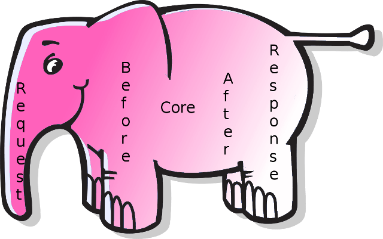

# :elephant: Nymfonya

is not a Symfony app...¯\\_(ツ)_/¯  

[](https://travis-ci.org/pierre-fromager/nymfonya)
[](https://scrutinizer-ci.com/g/pierre-fromager/nymfonya/)
[](https://scrutinizer-ci.com/g/pierre-fromager/nymfonya/)  




## ʕʘ̅͜ʘ̅ʔ Why

I want a zero conf consolable lightweight fast Rest backend & I :blue_heart: Php...OMG !!!

## :eyes: Introduction

Involved into backend projects based on Symfony or Laravel with Angular as front, I was frustrated about performances.
I turned to micro frameworks like Silex, Slim...to improve more.
A lot of them have been abandonned in favor of majors actors.
I can't figure why, maybe a lake of maintainers or people prefered something more generalistic and large feature oriented.

## :droplet: History

Composer package manager, introduced in 2011 changed the way to design php app with the concept of package and dependencie.
Autoloading RFCs as PSR-0 then PSR-4 were introduced a bit later aligning packages with namespace as vendor/feature.  
Php is still interpreted and requires sources to be loaded, parsed(AST), assembled(as opcode) then executed in Zend VM @ request time.
Some companies tried to compile source with JIT to speed up these steps (HipHop, HHVM) but did not ensure compatibility with the native source... :disappointed: !

## :crying_cat_face: Situation

To speed up packages's dependencies Composer introduced optimization options to build a 'resource catalog' by namespace.
To speed up the interpretation process php introduced Opcache as opcode cache but first run is still slower.
Despite all these benefits, some frameworks require around 3K files to boot, multiplying I/O on storage device and wasting memory.    
This is frustrating :rage: !  
We can do better, don't we ?   

## :ocean: Goals

* Minimize number of files and filesize at boot time.
* Minimize the memory usage at boot.
* Instanciate objects once.
* Inject objects everywhere by service container.
* Type hinting usage when we can (better with php => 7.3).
* Avoid slow processes as Reflection when we can.
* Prohibit functional annotations.
* Keep config as associative arrays.
* Runnable Kernel in server and cli mode.
* Isolate configs by Env.
* Log everything (Monolog) by env even errors.
* Responds minimal error structure with error code and message even no error.
* No magic methods.
* No globals nor define.
* Avoid static.
* Declare class constant in Interface.

## :horse: Arch

* :sunglasses: Monolithic App.
* :tropical_fish: Extra packages as feature only.
* :beer: I would say Mvc.
* :cyclone: Configs in config/$env.
* :shell: Run with php >= 7.0.

### Container

* not PSR-11.
* Instanciate classes with injected params.
* Roll-in precedence order.
* Container config is associative array (classname => params).

### Kernel

* Load Config.
* Instanciate services from container.
* Setup middlewares in design order (before/core/after).
* Run middleware sequence when routes match.
* Execute controler action as middleware core Closure.

### Services

* Config
* Logger (Monolog)
* Request (not PSR-7)
* Routes
* Router
* Controller
* Response (nor PSR-7)

### Rules
 
 * Request is 'Immutable'.
 * Container services can be modified.
 * Container injects Peel method middleware as first param.
 * Container injects Constructor controller method as first param.
 * Response modified at any time both by middlewares and controllers.

### Middlewares

Middleware stack must contain at least one.

* Cors : play with cross domain request (\ö/ Angular OPTIONS preflight).
* Jwt : deal with auth based on Jwt Token.
* After : terminator to ensure middleware logic is fully functional.

## :boom: Usage

### Server

#### Start

From root path

``` bash
composer run start
```

#### Play

Postman recommended.

##### Middleware Jwt
``` bash
#!/bin/bash
curl -v \
	--request POST \
	--url http://localhost:8888/api/v1/auth/login \
	--header 'Cache-Control: no-cache' \
	--header 'Connection: keep-alive' \
	--header 'Content-Type: application/json' \
	--header 'Host: localhost:8888' \
	--header 'cache-control: no-cache' \
	--data '{"login": "admin@domain.tld","password": "adminadmin"}'
```

Free access  
* http://localhost:8888/api/v1/stat/opcache
* http://localhost:8888/api/v1/test/pokerelay
* http://localhost:8888/api/v1/restful

Bearer Token required  
* http://localhost:8888/api/v1/stat/filecache
* http://localhost:8888/api/v1/test/jwtaction
* http://localhost:8888/api/v1/test/upload

##### Middleware Restufl

* http://localhost:8888/api/v1/restful  


##### Middleware Cors & After

Enabled for all endpoints.

### Cli

Ideal for batch mode, cron stuffs.
From the root of the project.
This does not require any server to be running.
Middleware Jwt is disable.  
Use [jq](https://stedolan.github.io/jq/) to pretty or filter json in console.

#### Sample Auth  
``` bash
php src/index.php '/api/v1/auth/login?login=admin@domain.tld&password=adminadmin' | jq
```

#### Sample Stat Opcache  
``` bash
php src/index.php '/api/v1/stat/opcache' | jq
```

#### Sample OpenApi Generator  
``` bash
php src/index.php '/config/swaggerdoc'
```

## :star2: Code

### Catalog
``` bash
find ./src -name *.php | grep -E -v 'vendor|config|test' | wc -l
```
### Complexity

* run phploc

``` bash
composer run cq
```

### Mess

* run phpmd (mess detector)

``` bash
composer run md
```

## :innocent: Tests

Run phpunit all tests.  
``` bash
composer run test
```

or targeted test replacing in above command 'test' by :

* testConfig
* testRequest
* testHeaders
* testResponse
* testRoutes
* testRouter
* ...@see composer.json

To get the code coverage the command below then browse coverage/index.html file.  

To run xdebug driver (xdebug required), considered as fat and buggy.  

``` bash
composer run cov
```

To run phpdbg driver (phpdbg required), faster and precise.  

``` bash
composer run covdbg
```

You can also use a very fast driver [PCOV](https://github.com/krakjoe/pcov).  
Check S.Bergmann [travis config](https://github.com/sebastianbergmann/php-code-coverage/blob/master/.travis.yml).


## :fire: Security

Develop app is dev job, secure it is one other.  

### Dev side

Use filters and validators everywhere and never trust input params.   

* [Filters type](https://www.php.net/manual/fr/filter.filters.php)
, [filter_input](https://www.php.net/manual/fr/function.filter-input.php).
, [filter_input_array](https://www.php.net/manual/fr/function.filter-input-array.php).
, [filter_var_array](https://www.php.net/manual/fr/function.filter-var-array.php).

### Devops side

Devops/SysAdmins should propose/setup solutions.  

* Prefer php-fpm to modules for flexibility.  
* Prefer Nginx to Apache for performance and http/2.  
* Do not use php server in prod (single threaded).  
* For static content setup varnish.

I would recommend third part services if exposed as below :

* apache(2) mod_security(2) to let OWASP breaks and logs most common attacks.
* Nginx ModSecurity.
* fail2ban in conjonction with mod_security(2) or ModSecurity to ban recurent attackers.

This should stop most common attacks but do not exempt your app to be bullet proofed.

Check your app logs with [Tail for Monolog](https://bytefreaks.net/gnulinux/bash/tail-logs-with-color-for-monolog) make logs reading easier.

Change some settings in php.ini

* Read [Linux 25 PHP Security Best Practices For Sys Admins](https://www.cyberciti.biz/tips/php-security-best-practices-tutorial.html)

## :hamster: Todo

### Core

* Refacto Request to use behind a proxy.
* Console tool.
* More middlewares before Acl, Waf, after Transfos...
* Isolate http & core as packages.
* Implement Bundle concept.
* Implement Controller forward method.
* Implement Response redirect 30X.

### Extra packages  

* Model with doctrine, mongodb, elasticsearch.
* Mail with swiftmailer.

## :chicken: Naming convention

* (I)nterface.
* (T)rait.

Controller action must be declared as final public.

## :tongue: Conclusion

I'm aware it requires improvements on many points and I'm sorry to break most PSR.(⌐■_■)  
Performance rocks (response 15ms for a 40X at first run, then 6ms).

I attempted to keep the code :

* short.
* readable and annotated.
* testable (Wip 93% methods coverage).
* explicit.
* decoupled.
* linted.
* type hinted (insofar as php v7.X compatibility).

Can't wait trying Php v8.0 [JIT](https://wiki.php.net/rfc/jit) with [DynAsm](https://luajit.org/dynasm.html).  
It should perf x4 face to v7.4 and generate native code (VM + AOT).  
You can try JIT from Php v7.4 as experimental feature (compile time) !  
Star and or fork then PR to improve it.  
Test it and be happy or not ¯\\_(ツ)_/¯  

## :panda_face: Extras

* Markdown [Emoji](https://gist.github.com/rxaviers/7360908).